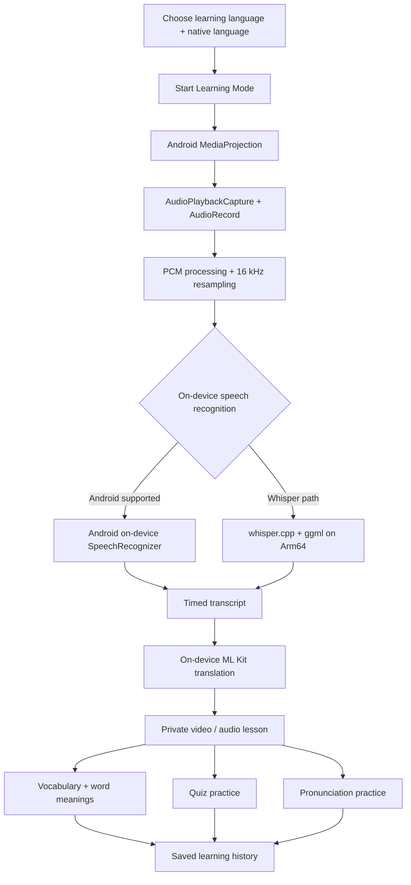

# ClipLex

**Turn every clip into a private multilingual language lesson.**

ClipLex is a private, on-device Android language-learning app that transforms permitted short media moments into replayable multilingual lessons, translated vocabulary, quizzes, speaking practice, and grounded tutoring.

[Download ClipLex v1.0.0 for ARM64 Android](https://github.com/jacksonkasi1/cliplex-android/releases/download/v1.0.0/ClipLex-v1.0.0-arm64.apk)

## What ClipLex does

ClipLex learns from media you already watch, including local videos and apps that allow Android playback capture. It does not download or scrape the source media.

ClipLex is **not limited to English → Tamil**. The current onboarding offers translation-ready learning choices including **Tamil, Hindi, English, Telugu, Kannada, Bengali, and Marathi**, while the speech pipeline can use multilingual Whisper models for broader multilingual recognition scenarios.

- Captures a user-selected audio or video moment of up to 180 seconds (3 minutes).
- Transcribes speech locally with `whisper.cpp` or Android on-device recognition.
- Uses English-specific Whisper models for English and multilingual Whisper models for supported non-English learning languages.
- Translates sentences and vocabulary with on-device ML Kit models.
- Opens words with their native-language meaning and English-letter pronunciation, such as `भाई → bhai`.
- Saves useful words with their correct source and meaning languages.
- Creates lesson-grounded quizzes automatically.
- Scores pronunciation privately using the microphone and local inference.
- Provides a private deterministic tutor grounded in the captured lesson.
- Opens video by default when a captured video exists, with an audio fallback.

The core learning loop is simple:

**Watch → Capture → Understand → Practise**

## How it works



1. Choose the language you are learning and your native language.
2. Start Learning Mode and approve Android's playback-capture prompt.
3. Play a permitted video or audio source, then start and finish a capture of up to three minutes.
4. ClipLex processes the captured audio locally and chooses the appropriate on-device speech-recognition path.
5. The transcript is translated on-device and turned into a synchronized private lesson.
6. Tap words to hear them, view meanings, see English-script pronunciation, or save them.
7. Open **Practice** for quizzes, Speak & Match pronunciation, and lesson-grounded help.

Captured media, transcripts, vocabulary, and prompts stay on the device. Protected or DRM media may block Android playback capture; ClipLex does not bypass platform or source-app restrictions.

## Multilingual learning

ClipLex is designed around the idea that the content you already watch can become language-learning material.

The current onboarding includes these translation-ready learning languages:

**Tamil · Hindi · English · Telugu · Kannada · Bengali · Marathi**

For English, ClipLex can use optimized English-specific Whisper models. For supported non-English learning languages, it switches to multilingual Whisper models. The architecture also includes an **Any Language** speech-recognition mode for multilingual scenarios.

The published performance benchmark uses English deliberately so the model, input audio, and transcript can stay fixed and reproducible. It should not be interpreted as an English-only product limitation.

## Product identity

- App name: **ClipLex**
- Play Store title: **ClipLex - Learn from Videos**
- Tagline: **Turn every clip into a language lesson.**
- Android package: `com.jacksonkasi.cliplex`
- Repository: `cliplex-android`

## Install

ClipLex requires Android 10 or newer on an ARM64 device.

1. Download [`ClipLex-v1.0.0-arm64.apk`](https://github.com/jacksonkasi1/cliplex-android/releases/download/v1.0.0/ClipLex-v1.0.0-arm64.apk).
2. Allow installation from your browser or file manager when Android asks.
3. Open ClipLex, choose your learning language, and download the suggested local speech model during onboarding.

The public APK is a release-optimized, non-debuggable, minified direct-distribution build for challenge judging. Google Play publishing requires the maintainer's permanent private upload key and the `safeRelease` build type.

## Build from source

Requirements: Android SDK 36, NDK `27.2.12479018`, CMake `3.22.1`, JDK 21, ADB, and Git with submodule support.

```powershell
git clone --recurse-submodules https://github.com/jacksonkasi1/cliplex-android.git
cd cliplex-android
git submodule update --init --recursive
.\gradlew.bat :app:testSafeSubmissionUnitTest :app:lintSafeSubmission :app:assembleSafeSubmission
```

Install the release-optimized challenge build on a connected device:

```powershell
adb install -r app\build\outputs\apk\safe\submission\app-safe-submission.apk
```

Build the unsigned Play-ready release bundle, then sign it with the maintainer's private upload key:

```powershell
.\gradlew.bat :app:bundleSafeRelease
```

The compact `safe` flavor does not request overlay permission and excludes the optional LiteRT-LM runtime. It retains the private deterministic tutor. The `overlay` flavor provides the floating capture control and experimental Gemma runtime for development builds.

## Run and validate on Arm64

1. Connect an Android 10+ Arm64 phone with USB debugging enabled and run `adb devices -l`.
2. Install `safeSubmission` with the command above and open ClipLex.
3. Choose any supported onboarding learning language and download the suggested local speech model. Model files are downloaded separately and integrity-checked.
4. Capture permitted playback, finish the clip, and confirm that ClipLex shows a transcript, translation, synchronized lesson, tappable word meanings, and practice activities.
5. To reproduce the published Arm64 benchmark specifically, choose **English** and use **Whisper Tiny English (Q5_1)** with the fixed benchmark sample and procedure.
6. Use a debug build for the known-good ASR diagnostic and benchmark UI.
7. Follow [`benchmarks/BENCHMARK.md`](benchmarks/BENCHMARK.md) to reproduce the Arm64 baseline-versus-optimized Whisper comparison.

Verified physical target: OPPO CPH2781, MediaTek MT6835, `arm64-v8a`, Android 16/API 36. See [Arm optimization details](docs/ARM_OPTIMIZATION.md) and the [preserved device result](benchmarks/results/oppo-cph2781.md).

### Measured Arm64 result

On the physical target, a controlled 9.4-second Whisper test with two warm-ups and five measured runs reduced median native inference from **2,393.764 ms** to **692.659 ms**: **3.456x faster** and **71.06% lower latency**, with matching normalized transcript content. Inspect every phone-generated observation in the [raw CSV](benchmarks/results/oppo-cph2781-2026-08-08-raw.csv) and reproduce it with the [benchmark runner](benchmarks/BENCHMARK.md).

## Goal

ClipLex turns everyday multilingual watching into active learning: capture a meaningful moment, understand it immediately, retain its vocabulary, practise saying it, and revisit it through personalized exercises without sending private learning data to a server.

See [development setup](docs/DEVELOPMENT_SETUP.md), [capture diagnostics](docs/AUDIO_CAPTURE_DIAGNOSTICS.md), [known limitations](docs/KNOWN_LIMITATIONS.md), and [v1.0.0 release notes](docs/RELEASE_NOTES_V1.0.0.md).

## License

ClipLex source code is available under the [MIT License](LICENSE), copyright 2026 Peacock India. Third-party libraries, model weights, and assets remain under their own terms; see [third-party notices](THIRD_PARTY_NOTICES.md).
